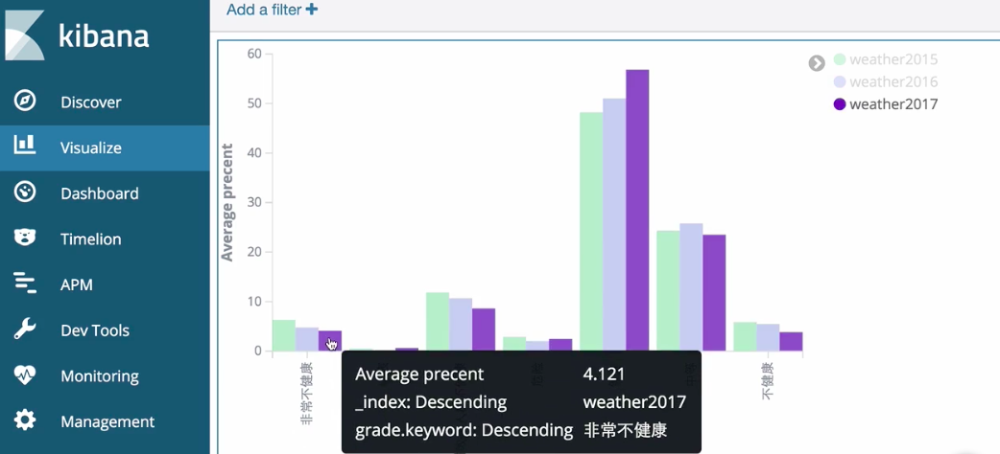
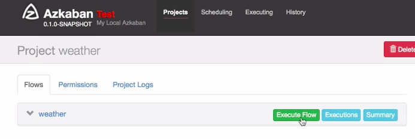

# Air Quality Analysis using Pyspark and Kibana

## About The Project



Build a data pipeline using pyspark to analyze weather condition in China. 

Main steps:
* Download official air quality data from http://stateair.net/web/historical/1/1.html and upload datasets into HDFS 
* Read datasets using pyspark and compute required dataframe
* Run the job in yarn
* Write analyzing result into Elastic Search
* Visualize result using Kibana
* Use Azkaban to schedule the whole work flow


## Getting Started


### Installation
- JDK
- Hadoop
- Spark
- Scala
- Elastic Search
- Kibana (need to be the same version as Elastic Search)


### Yarn 
Yarn is used for Hadoop job monitoring and scheduling.
To use yearn, you need to ensure ResourceManager and NodeManager are available using the following command.
``` bash
$ jps 
```
Run the following command to run jobs in yarn.
``` bash
$ cd $SPARK_HOME
$ cd bin 
$ ./spark-submit --master yarn ~/PYSPARK_PIPELINE/spark_yarn.py
```

### Elastic Search
To upload datasets into Elastic Search, you need to download .jar file for elastic-search-spark with the same versino as your elastic search package, which can be found in maven repository. 

Then, start pyspark shell by:
``` bash
$ cd $SPARK_HOME
$ cd bin 
$ ./pyspark --master local[2] --jars {your_path}/elasticsearch-spark-{your_version}.jar
```
To compute new dataframe, 
copy and paste scripts from `spark_es.py` into the pyspark shell.


### Azkaban
To use Azkaban scheduler, you need to compress following files and upload the zip file into the Azkaban main page. Then, click `Execute Flow`. 
 


## Oppurtunities
- Create more visualization charts in Kibana
- Publish Kibana dashboard
- Use streaming air quality dataset from API


<p align="right">(<a href="#top">back to top</a>)</p>

